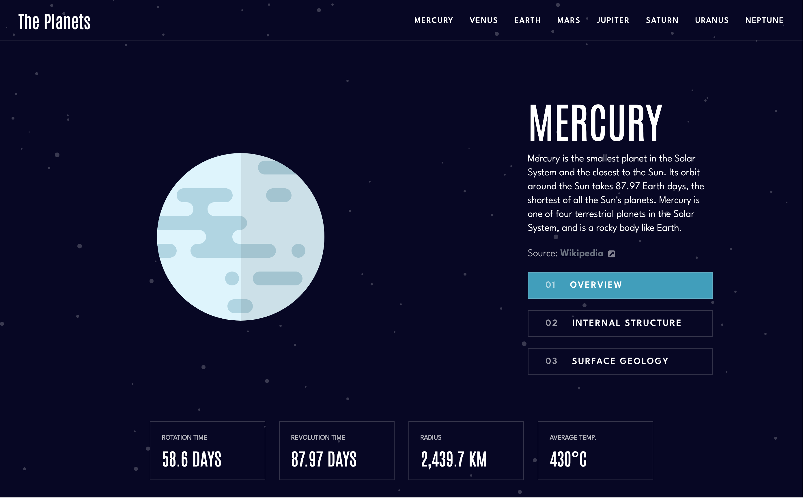

# Frontend Mentor - Planets fact site solution

This is a solution to the [Planets fact site challenge on Frontend Mentor](https://www.frontendmentor.io/challenges/planets-fact-site-gazqN8w_f). Frontend Mentor challenges help you improve your coding skills by building realistic projects. 

## Overview

### The challenge

Users should be able to:

- View the optimal layout for the app depending on their device's screen size
- See hover states for all interactive elements on the page
- View each planet page and toggle between "Overview", "Internal Structure", and "Surface Geology"

### Screenshot

### Links

- Solution URL: [FrontEndMentor](https://www.frontendmentor.io/solutions/planets-fact-site-with-vuejs-and-tailwind-h98ooNeiIO)
- Live Site URL: [planets-fact-site](https://planets-fact-site-five-theta.vercel.app)

## My process

### Built with

- Tailwind CSS
- Vue 
- Vue router

### What I learned 

During this project i tried tailwind css for the first time. I am very happy with the results although i would not use tailwind css for detailed oriented projects.

## Author
- Frontend Mentor - [@yourusername](https://www.frontendmentor.io/profile/sopynya)